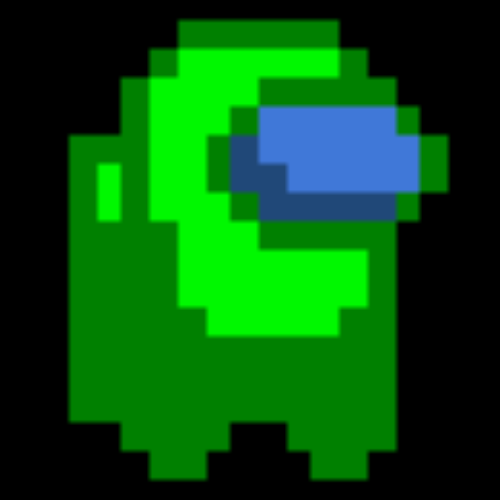
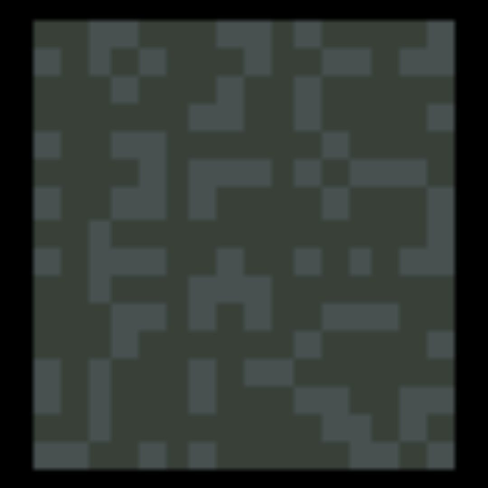

## ***Escape Us***  
> *A 2D puzzle platformer game where you take control of two crewmates — suspiciously familiar faces from* ***Among Us*** *— who have been ejected into a dangerous dungeon.*
> *Whether you are innocent or an impostor is anyone's guess, but one thing is for sure: you need to work together to survive and escape.*

- **Your goal is simple:** collect the key, unlock the exit door, and guide BOTH crewmates safely to the exit.
- **Spot a platform that is just out of reach?** Switch between the two crewmates and cooperate in creative ways to reach it!
- **The mission fails if:** either of the crewmates falls off the platform, touches a bomb, or runs into a roaming slime monster.

## How To Play
To play, open and run `escape_us.gba` using `VisualBoyAdvance.exe`. The following are GBA button controls，with their equivalent keybindings for PC/laptop keyboards (shown in parentheses).

| **Key**                        | **Action**                                                             |
|--------------------------------|------------------------------------------------------------------------|
| `START` (`ENTER`) or `A` (`Z`) | Start the game, proceed to the next level, or return to the main menu. |
| `→`                            | Move right.                                                            |
| `←`                            | Move left.                                                             |
| `↑` or `A` (`Z`)               | Jump or enter the exit door.                                           |
| `B` (`X`)                      | Switch between crewmates.                                              |

## Game Elements
| **Game Element** | **Description** |
|------------------|-----------------|
| **Crewmate(s)**  | You in the game! The character(s) that you control. |
| **Arrow**  | A visual cue that points to the crewmate you are currently controlling. |
| **Platform**  | These are your safe zones within the game. Watch your steps while moving around! |
| **Key**  | The key is your ticket to freedom. It can be passed between crewmates if they’re close enough when you switch between characters. |
| **Exit**  | Your way out — but only if you have gotten the key first. |
| **Bomb**  | Explosive and dangerous! |
| **Slime Monster**  | While they may look cute, these little guys are deadly. They patrol back and forth between two points. |

## Code Structure
| **File**            | **Description** |
|---------------------|-----------------|
| **main.c**          | - Serves as the main entry point for the game. - Initializes the game environment and sets up configurations, such as loading the color palette and sprite data into GBA memory. - Handles GBA interrupts, specifically the timer interrupt, which is triggered at a certain frequency to check user inputs (button presses) and refresh screen graphics. |
| **game.h**          | - Contains the primary logic of the game. - Checks for button input (with cooldown feature). Based on the user input, updates the game state. - Checks win and loss conditions to update and track game states. - Manages the core game flow and transitions between menus, levels, and game-over screens. |
| **menu.h**          | - Handles the display of the main menu and the ending screens. |
| **level.h/.c**      | - Manages the structure of the game levels. Each level is represented by a grid of tiles, where each tile is 16x16 pixels (the standard sprite size). The GBA screen, with a resolution of 240x160 pixels, is divided into a 10x16 tile grid. - Stores and renders level data on screen, including the initialization and movement logic of slime monsters. - Contains helper functions to obtain the types for static tiles at specific coordinates, for collision detection and evaluating the game state. |
| **player.h/.c**     | - Manages player (crewmate) attributes (e.g., position, velocity) and handles interactions with the environment. - Contains the main logic for player movements and switching between players. - Implements core physics features such as gravity, jumping, falling, and landing on surfaces or other players. - Performs collision detection to prevent movement through walls, ceilings, obstacles, or other players. |
| **sprites.h/.c**    | - Stores information about the sprite color palette and the actual sprite data (the graphical representation of the elements). Each sprite is represented as a 16x16 pixel image, which is divided into four 8x8 tiles. |
| **mygbalib.h/.c**   | - Provides rendering helper functions to draw and delete sprites on the screen, as well as clear the screen. |
| **gba.h**           | - Contains constant definitions for the GBA hardware, including memory addresses, screen configurations, and other system constants. |

